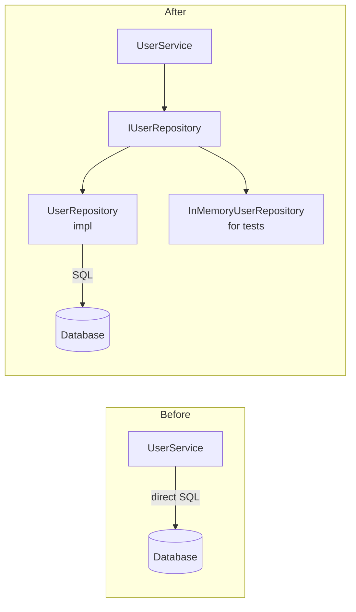

# Plan: Refactor User Service to Repository Pattern

| Field | Value |
|-------|-------|
| Status | draft |
| Created | 2026-04-05 |
| Ticket | ENG-412 |
| Branch | refactor/user-repository |

## Context

`UserService` has grown to 800+ lines and directly calls the database in 23 different places. Adding tests is nearly impossible because there's no seam to inject a test database. This refactor introduces a `UserRepository` interface that all DB calls go through, making the service independently testable and the data layer swappable.

## Architecture Decisions

- **Interface-first** — Define `IUserRepository` protocol/interface first. The service depends on the interface, not the implementation.
- **No ORM change** — Keep the existing ORM queries; just move them behind the interface. This is a structural refactor, not a rewrite.
- **Incremental migration** — Move methods one milestone at a time. Each milestone leaves the service in a working state so CI stays green throughout.
- **Test doubles** — Tests get an `InMemoryUserRepository` that satisfies the interface. No database required for unit tests.

## Diagrams



## Milestones Overview

1. **Interface & Infrastructure** — Define protocol, create real + in-memory implementations
2. **Read Methods** — Migrate all `get_*` and `find_*` calls
3. **Write Methods** — Migrate all `create_*`, `update_*`, `delete_*` calls

---

## Milestone 1: Interface & Infrastructure

Define the contract before moving any code.

### 1.1 [ ] Define IUserRepository interface

- **Files:** `src/repositories/user_repository.py` (new)
- **What:**
  1. Create `IUserRepository` abstract base class with abstract methods matching the 23 DB call signatures currently in `UserService`.
  2. Create `UserRepository(IUserRepository)` concrete class that contains the existing ORM calls (copy from service).
  3. Create `InMemoryUserRepository(IUserRepository)` with dict-based storage for tests.
- **Acceptance:** Both concrete classes instantiate without errors. `isinstance(repo, IUserRepository)` returns True for both.
- **Dependencies:** None

### 1.2 [ ] Wire UserRepository into UserService via dependency injection

- **Files:** `src/services/user_service.py`, `src/dependencies.py`
- **What:**
  1. Add `repo: IUserRepository` parameter to `UserService.__init__`. Default to `UserRepository()` so existing call sites don't break.
  2. Register `UserRepository` as a singleton in the DI container (`src/dependencies.py`).
  3. Don't migrate any methods yet — service still calls DB directly in all 23 places.
- **Acceptance:** App starts, all existing tests pass, no behavior change.
- **Dependencies:** 1.1

---

## Milestone 2: Read Methods

### 2.1 [ ] Migrate get_user_by_id and get_user_by_email

- **Files:** `src/services/user_service.py`
- **What:** Replace direct DB calls in `get_user_by_id` and `get_user_by_email` with `self.repo.get_by_id(id)` and `self.repo.get_by_email(email)`. Delete the now-unused ORM lines from the service.
- **Acceptance:** Unit tests using `InMemoryUserRepository` pass. Integration tests pass.
- **Dependencies:** 1.2

### 2.2 [ ] Migrate remaining read methods (find_*, list_*)

- **Files:** `src/services/user_service.py`
- **What:** Same pattern as 2.1 for all remaining read methods: `find_users_by_org`, `list_active_users`, `search_users`.
- **Acceptance:** All read paths covered by unit tests. No direct DB calls remain in read methods.
- **Dependencies:** 2.1

---

## Milestone 3: Write Methods

### 3.1 [ ] Migrate create_user and update_user

- **Files:** `src/services/user_service.py`
- **What:** Move `create_user` and `update_user` ORM calls into the repository. Update service to call `self.repo.create(...)` and `self.repo.update(...)`.
- **Acceptance:** Tests cover creation and update via `InMemoryUserRepository`. No ORM import remains in `user_service.py` for these methods.
- **Dependencies:** 2.2

### 3.2 [ ] Migrate delete_user and archive_user

- **Files:** `src/services/user_service.py`
- **What:** Same pattern for delete/archive. After this task, `user_service.py` should have zero direct ORM/DB imports.
- **Acceptance:** `grep -n "from sqlalchemy\|import db\|session.query" src/services/user_service.py` returns zero results.
- **Dependencies:** 3.1

### 3.3 [ ] Remove ORM imports from UserService, write full unit test suite

- **Files:** `src/services/user_service.py`, `tests/unit/test_user_service.py` (new)
- **What:**
  1. Confirm and remove any remaining ORM imports from `user_service.py`.
  2. Write unit tests for all 23 original DB call sites using `InMemoryUserRepository` — no database required, runs in milliseconds.
- **Acceptance:** `pytest tests/unit/test_user_service.py` passes in <1 second (no DB). `pytest tests/integration/` passes against real DB.
- **Dependencies:** 3.2

---

## Verification

```bash
# 1. No direct DB/ORM calls remain in UserService
grep -n "session\|query\|from sqlalchemy" src/services/user_service.py
# → zero results

# 2. Full test suite passes
pytest tests/ -v

# 3. Unit tests run fast (no DB)
time pytest tests/unit/test_user_service.py
# → <1 second

# 4. App starts and handles requests normally
uvicorn src.main:app --reload
# → smoke test key endpoints
```
