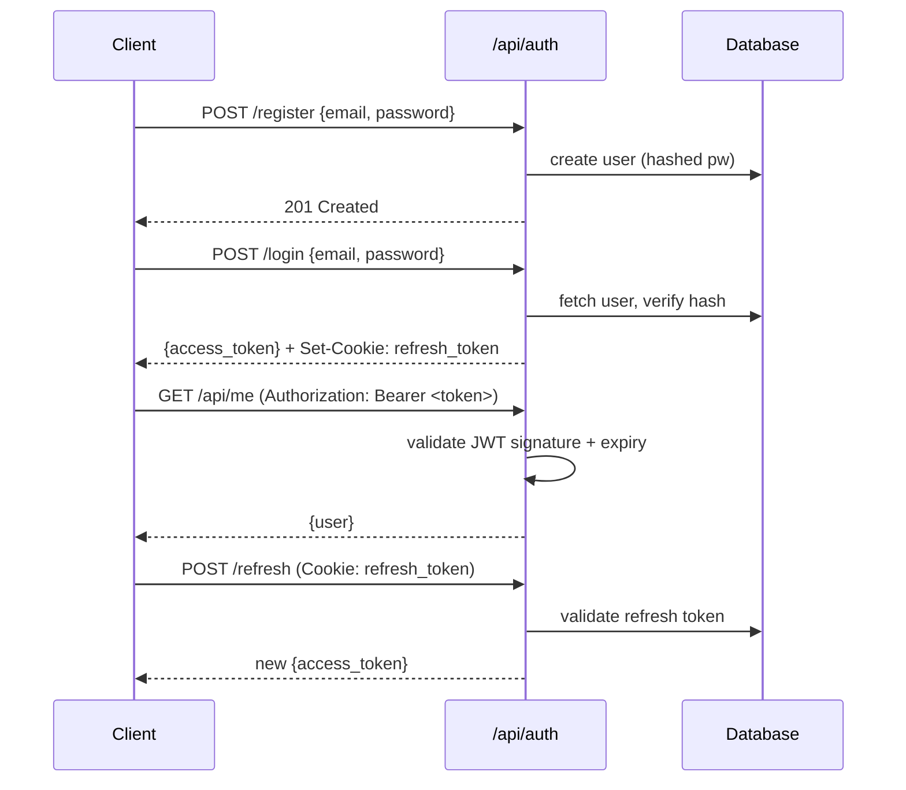

# Plan: Add JWT Authentication System

| Field | Value |
|-------|-------|
| Status | draft |
| Created | 2026-04-10 |
| Ticket | ENG-550 |
| Branch | feature/jwt-auth |

## Context

The app currently has no authentication. All API endpoints are open. We need a standard JWT-based auth system: registration, login, token refresh, and route protection. This is a prerequisite for all user-specific features on the roadmap.

## Architecture Decisions

- **JWT (stateless)** — No session store. Access tokens expire in 15 minutes; refresh tokens in 7 days and stored in an httpOnly cookie to prevent XSS.
- **bcrypt for passwords** — Industry standard. Use `passlib[bcrypt]` on the backend.
- **Separate auth router** — `/api/auth/*` routes in their own module, not mixed into `users.py`.
- **Middleware for protection** — A single `get_current_user` dependency handles token validation for any route that needs auth. Routes opt in by declaring the dependency, not by a global flag.
- **No magic links or OAuth for MVP** — Email/password only. OAuth can be layered on top later.

## Diagrams



## Milestones Overview

1. **Data layer** — User model + password hashing + token storage
2. **Auth endpoints** — Register, login, refresh, logout
3. **Route protection** — Dependency injection + middleware
4. **Frontend integration** — Auth context, login UI, token refresh

---

## Milestone 1: Data Layer

### 1.1 [ ] Add User model with hashed password field

- **Files:** `src/models/user.py`, `migrations/add_users_table.py` (new)
- **What:**
  1. Create `User` model: `id` (UUID), `email` (unique), `hashed_password`, `created_at`, `is_active`.
  2. Write Alembic migration.
  3. Add `UserCreate` and `UserRead` Pydantic schemas.
- **Acceptance:** `alembic upgrade head` creates the table. `UserRead` excludes `hashed_password` from serialization.
- **Dependencies:** None

### 1.2 [ ] Add password hashing utilities

- **Files:** `src/auth/password.py` (new), `pyproject.toml`
- **What:**
  1. Add `passlib[bcrypt]` to dependencies.
  2. Create `hash_password(plain: str) -> str` and `verify_password(plain: str, hashed: str) -> bool`.
- **Acceptance:** `verify_password("abc", hash_password("abc"))` returns True. `verify_password("abc", hash_password("xyz"))` returns False.
- **Dependencies:** None

### 1.3 [ ] Add JWT creation and validation utilities

- **Files:** `src/auth/tokens.py` (new), `src/config.py`
- **What:**
  1. Add `JWT_SECRET`, `ACCESS_TOKEN_EXPIRE_MINUTES=15`, `REFRESH_TOKEN_EXPIRE_DAYS=7` to config.
  2. Create `create_access_token(user_id: str) -> str` using `python-jose`.
  3. Create `decode_access_token(token: str) -> str | None` — returns user_id or None on invalid/expired.
  4. Create `create_refresh_token(user_id: str) -> str` (longer expiry).
- **Acceptance:** A token created with `create_access_token` can be decoded with `decode_access_token` to recover the user_id.
- **Dependencies:** None

---

## Milestone 2: Auth Endpoints

### 2.1 [ ] Implement POST /api/auth/register

- **Files:** `src/routers/auth.py` (new), `src/main.py`
- **What:**
  1. Accept `{email, password}`. Validate email format. Check no existing user with that email.
  2. Hash password, create user record.
  3. Return 201 with `UserRead`. Return 409 if email taken.
  4. Register `auth_router` in `main.py` under `/api/auth`.
- **Acceptance:** `POST /api/auth/register` with a new email creates a user. Second call with same email returns 409.
- **Dependencies:** 1.1, 1.2

### 2.2 [ ] Implement POST /api/auth/login

- **Files:** `src/routers/auth.py`
- **What:**
  1. Accept `{email, password}`. Fetch user by email. Verify password.
  2. On success: return `{access_token, token_type: "bearer"}` in body + set `refresh_token` in httpOnly cookie.
  3. On failure: return 401 with generic error (don't reveal whether email or password was wrong).
- **Acceptance:** Valid credentials return 200 with access token. Invalid credentials return 401. Cookie is set with `httpOnly=True, secure=True, samesite="lax"`.
- **Dependencies:** 2.1, 1.3

### 2.3 [ ] Implement POST /api/auth/refresh and POST /api/auth/logout

- **Files:** `src/routers/auth.py`
- **What:**
  - `/refresh`: Read `refresh_token` cookie. Validate it. Issue new access token. Return 401 if invalid/expired.
  - `/logout`: Clear the `refresh_token` cookie. Return 200.
- **Acceptance:** After login, `/refresh` issues a new access token. After `/logout`, `/refresh` returns 401.
- **Dependencies:** 2.2

---

## Milestone 3: Route Protection

### 3.1 [ ] Add get_current_user dependency

- **Files:** `src/auth/dependencies.py` (new)
- **What:**
  1. Create `get_current_user(token: str = Depends(oauth2_scheme)) -> User` FastAPI dependency.
  2. Decodes the token, fetches the user from DB, raises 401 if invalid.
  3. Create `get_current_active_user` that additionally checks `user.is_active`.
- **Acceptance:** A route decorated with `Depends(get_current_user)` returns 401 without a valid token and 200 with one.
- **Dependencies:** 1.3, 2.1

### 3.2 [ ] Protect existing routes

- **Files:** `src/routers/users.py`, `src/routers/items.py` (any existing routes)
- **What:** Add `current_user: User = Depends(get_current_user)` to all routes that need auth. Remove any open-access assumptions.
- **Acceptance:** All protected routes return 401 without token. All pass existing tests when token is provided.
- **Dependencies:** 3.1

---

## Milestone 4: Frontend Integration

### 4.1 [ ] Add AuthContext and token storage

- **Files:** `src/contexts/AuthContext.tsx` (new), `src/hooks/useAuth.ts` (new)
- **What:**
  1. `AuthContext` holds `user | null` and `login/logout` functions.
  2. `login(email, password)` calls `POST /api/auth/login`, stores access token in memory (not localStorage — XSS risk). Refresh token lives in httpOnly cookie automatically.
  3. `logout()` calls `POST /api/auth/logout`, clears in-memory token.
  4. On app mount, attempt a silent refresh to restore session.
- **Acceptance:** Refreshing the page while logged in keeps the user logged in (via cookie-based silent refresh).
- **Dependencies:** 2.3

### 4.2 [ ] Add login page and protect frontend routes

- **Files:** `src/pages/Login.tsx` (new), `src/components/ProtectedRoute.tsx` (new), `src/App.tsx`
- **What:**
  1. Login form: email + password fields, submit calls `useAuth().login()`, redirect to `/` on success.
  2. `ProtectedRoute` component: wraps routes that need auth, redirects to `/login` if not authenticated.
  3. Wrap all existing app routes with `ProtectedRoute` in `App.tsx`.
- **Acceptance:** Navigating to any app page while logged out redirects to `/login`. After login, redirects back to the original destination.
- **Dependencies:** 4.1

---

## Verification

```bash
# 1. Unit tests
pytest tests/unit/test_auth.py -v
# → password hashing, token creation/validation, dependency tests

# 2. Integration tests (real DB)
pytest tests/integration/test_auth_routes.py -v
# → full register/login/refresh/logout cycle

# 3. Manual happy path
# - POST /api/auth/register → 201
# - POST /api/auth/login → 200 + cookie
# - GET /api/me → 200 with user
# - POST /api/auth/refresh → new access token
# - POST /api/auth/logout → 200, cookie cleared
# - GET /api/me → 401

# 4. Security checks
# - Access token after 15min → 401
# - Tampered JWT signature → 401
# - Missing cookie on /refresh → 401
```
